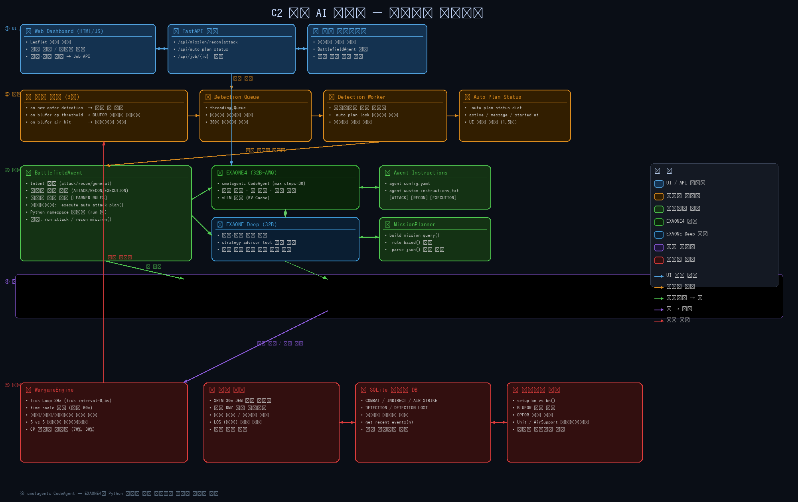

# C2 군사 전략 AI

EXAONE4 기반 C2(지휘통제) AI 시스템입니다.  
Python 워게임 시뮬레이터와 연동하여 정찰·공격 임무계획 수립, 전략/전술 추천을 수행합니다.

---

## 시스템 아키텍처



### 레이어 설명

| 레이어 | 색상 | 구성 요소 |
|--------|------|-----------|
| **UI Layer** | 파랑 | Gradio 웹 인터페이스 — AI 채팅, 워게임 시뮬레이터, 전장 지도 탭 |
| **Agent / Planner** | 초록 | `BattlefieldAgent` (smolagents CodeAgent, EXAONE4) + `MissionPlanner` + `DetectionWorker` |
| **Tools** | 주황·청록·보라 | 에이전트가 코드로 호출하는 도구 레이어 — 17개 도구, 스텝당 1개 제한 |
| **Core Systems** | 보라·빨강 | WargameEngine, EXAONE4 LLM (vLLM 서빙), rdflib 온톨로지 |
| **Data / External** | 빨강 | 시나리오, SQLite DB, COHA 온톨로지 TTL |

### 모델 아키텍처

| 모델 | 역할 |
|------|------|
| **EXAONE4-32B-AWQ** | 메인 CodeAgent — 상황 판단, 전략/전술 추천, 임무계획 수립, 최종 응답 |

---

## 빠른 시작

```bash
# 패키지 설치
pip install -r requirements.txt

# 1) vLLM 서버 기동 (EXAONE4, 별도 터미널)
python scripts/launch_vllm_servers.py

# 2) AI 시스템 기동 (Gradio UI)
python main.py ui
```

브라우저에서 출력된 Gradio URL에 접속합니다.

> LLM은 애플리케이션 프로세스 내부가 아닌 별도 vLLM 서버(OpenAI 호환 API)에서 동작합니다.
> 서버 주소는 `config/models_config.yaml`의 `agent_model.serving`(기본 `127.0.0.1:8000`)
> 또는 환경변수 `C2_AGENT_VLLM_BASE_URL`로 설정합니다.

### vLLM 서버 수동 실행 (nohup 백그라운드, A100 80GB 기준)

런처 스크립트 대신 서버를 직접 띄우는 방법입니다.
`nohup` + 백그라운드(`&`)로 실행하므로 SSH/터미널을 닫아도 유지되며,
로그는 `out1.log`에 기록됩니다.

```bash
# EXAONE4 (:8000) → out1.log
nohup vllm serve LGAI-EXAONE/EXAONE-4.0-32B-AWQ --host 127.0.0.1 --port 8000 \
  --served-model-name exaone4-agent --trust-remote-code \
  --quantization awq_marlin --dtype float16 \
  --gpu-memory-utilization 0.43 --max-model-len 33768 \
  --enable-prefix-caching \
  > out1.log 2>&1 &
```

```bash
# 로딩 진행 확인 (Ctrl+C는 tail만 종료)
tail -f out1.log

# 서버 준비 확인 (200이면 준비 완료)
curl http://127.0.0.1:8000/health
```

주의 사항:

- `2>&1`이 stderr(vLLM 로그 대부분)를 로그 파일로 합쳐주므로 반드시 포함해야 합니다.
- 재실행 시 `>`는 기존 로그를 덮어씁니다. 이어 쓰려면 `>>`로 변경하세요.
- `--served-model-name`(`exaone4-agent`)은
  `models_config.yaml`의 `serving.served_model_name`과 일치해야 합니다.

서버 종료:

```bash
pkill -f "vllm serve"                      # 종료
sleep 5 && nvidia-smi                      # GPU 메모리 반환 확인 후 재시작
```

---

## Google Colab에서 실행

EXAONE4-32B(AWQ)를 **별도 vLLM 서버(OpenAI 호환 API)**로 띄우고, 앱은 그 서버에 접속합니다.
따라서 Colab에서는 **① vLLM 서버**(포트 8000)와 **② 웹 UI**(포트 7860) 두 프로세스를
백그라운드로 함께 띄웁니다. 32B 모델이므로 **A100 GPU가 필요**합니다.

| 런타임 | 가능 여부 | 비고 |
|--------|-----------|------|
| **A100 80GB** (Colab Pro+) | ✅ 권장 | 기본 설정 그대로 사용 |
| **A100 40GB** (Colab Pro) | ✅ | `config/models_config.yaml`의 `agent_model.gpu_memory_utilization`/`max_model_len`를 낮춰 조정 |
| T4 / L4 (무료·기본) | ❌ 불가 | 16~24GB로 32B AWQ 로딩 불가 |

> 런타임 설정: **런타임 → 런타임 유형 변경 → 하드웨어 가속기: A100 GPU**

### 1) 저장소 클론 (비공개 저장소 → 토큰 필요)

```python
# GitHub Personal Access Token (repo 권한) 사용
GH_TOKEN = "ghp_..."   # 본인 토큰으로 교체
!git clone -b claude/repo-access-check-lo2915 https://{GH_TOKEN}@github.com/Parkdev22222/C2_program_ai.git
%cd C2_program_ai
```

### 2) 패키지 설치 (설치 순서 준수 — vLLM/transformers 버전 고정)

```python
# Step 1: 충돌 패키지 제거
!pip uninstall vllm transformers torchaudio -y -q

# Step 2: vLLM 고정 설치 (torch는 vLLM이 자동 설치)
!pip install "vllm==0.6.6.post1" -q

# Step 3: Colab 전용 의존성 설치 (openai 클라이언트·neo4j 등 포함)
!pip install -r requirements-colab.txt -q
```

> ⚠️ 설치 후 **런타임을 재시작**하세요(런타임 → 세션 다시 시작). 재시작 후 `%cd C2_program_ai`로 다시 이동합니다.
> `transformers 4.48+` / `vllm ≥ 0.7.0`은 Colab에서 커널 ABI 충돌을 일으키므로 위 버전을 반드시 고정합니다.

### 3) (선택) 온톨로지 Neo4j 연결

워게임 상태는 동일 스키마 온톨로지로 변환되어 실시간 적재됩니다. **환경변수를 설정하지 않으면
자동으로 in-memory 그래프로 폴백**되므로 Neo4j 없이도 동작합니다. 원격 Neo4j(예: Neo4j Aura)를
쓰려면 서버 기동 전에 설정하세요.

```python
import os
os.environ["OI_NEO4J_URI"]      = "neo4j+s://<your-db>.databases.neo4j.io"
os.environ["OI_NEO4J_USER"]     = "neo4j"
os.environ["OI_NEO4J_PASSWORD"] = "<password>"
```

### 4) vLLM 서버 기동 (백그라운드, 포트 8000)

`scripts/launch_vllm_servers.py`가 `config/models_config.yaml`을 읽어 EXAONE4를
OpenAI 호환 vLLM 서버로 띄웁니다. Colab에서는 백그라운드 프로세스로 실행하고
`/health`가 200이 될 때까지 대기합니다(가중치 다운로드 포함 수~수십 분 소요).

```python
import subprocess, time, urllib.request

# EXAONE4 vLLM 서버를 백그라운드로 기동 (로그: logs/vllm_*.log)
vllm_proc = subprocess.Popen(["python", "scripts/launch_vllm_servers.py"])

# 서버 준비(/health=200) 대기
ready = False
for _ in range(360):  # 최대 ~30분
    try:
        with urllib.request.urlopen("http://127.0.0.1:8000/health", timeout=3) as r:
            if r.status == 200:
                ready = True
                break
    except Exception:
        pass
    time.sleep(5)
print("vLLM 서버 준비 완료" if ready else "아직 준비 안 됨 — logs/vllm_*.log 확인")
```

> 진행 로그 확인: `!tail -n 40 logs/vllm_exaone4-agent.log`

### 5) 웹 UI 기동 + Colab 포트 노출 (포트 7860)

앱은 위 vLLM 서버(:8000)에 접속하는 클라이언트만 만들므로 자체 모델 로딩은 없습니다.
FastAPI 서버를 백그라운드 스레드로 띄운 뒤 Colab 포트를 노출합니다.

```python
import threading, time
from main import init_agent
from ui.web_api import start_server

# vLLM 서버(:8000)에 연결하는 에이전트 생성
agent = init_agent()

# FastAPI 대시보드를 백그라운드 스레드로 기동 (포트 7860)
threading.Thread(
    target=lambda: start_server(agent=agent, host="0.0.0.0", port=7860),
    daemon=True,
).start()
time.sleep(5)

# Colab 인라인 창으로 대시보드 열기
from google.colab.output import serve_kernel_port_as_window
serve_kernel_port_as_window(7860)
```

> 새 탭 대신 인라인 프레임으로 열려면 `serve_kernel_port_as_window` 자리에
> `from google.colab.output import serve_kernel_port_as_iframe; serve_kernel_port_as_iframe(7860)`
> 를 사용하거나, 출력된 링크를 클릭하세요.

### 자주 겪는 문제

- **CUDA OOM**: `config/models_config.yaml`의 `agent_model.gpu_memory_utilization`을 낮추거나 `max_model_len`을 줄이세요(GPU별 권장값은 파일 주석 참고). A100 40GB는 특히 조정이 필요합니다.
- **`/health`가 계속 실패**: `logs/vllm_exaone4-agent.log`의 마지막 부분을 확인하세요(OOM·다운로드 지연 등). 서버가 죽었으면 4)를 다시 실행합니다.
- **`No module named 'vllm'` / ABI 오류**: 2)의 버전 고정과 **런타임 재시작**을 다시 확인하세요.
- **모델 다운로드 지연**: HuggingFace에서 32B 가중치를 받으므로 시간이 걸립니다. 필요 시 `huggingface-cli login`으로 토큰을 등록하세요.
- **서버 종료**: `vllm_proc.terminate()` 또는 `!pkill -f "vllm serve"` 후 `!nvidia-smi`로 GPU 메모리 반환을 확인하세요.

---

## 워게임 시뮬레이터

내장 Python 워게임 엔진으로 대대급 전투를 시뮬레이션합니다.

### 시나리오 편제 (기계화 보병 대대 vs 대대)

| 진영 | 부대 ID | 병종 | 역할 |
|------|---------|------|------|
| BLUFOR | `Alpha` | 기계화보병 | 정면 공격 |
| BLUFOR | `Bravo` | 기계화보병 | 측방 기동 |
| BLUFOR | `Charlie` | 전차 | 기갑 돌파 |
| BLUFOR | `Delta` | **정찰** | 적 위치 탐지 (탐지 반경 8 km) |
| BLUFOR | `Echo` | 대전차 | 기갑 저지 |
| BLUFOR | `Foxtrot` | 자주포 | 화력 지원 |
| OPFOR | `Red1~Red5` | 혼성 | 방어·반격 |

### 탐지 반경 (Fog of War)

| 병종 | 기본 탐지 반경 | 확정 탐지 (50%) |
|------|--------------|----------------|
| 정찰 (Delta) | 8,000 m | 4,000 m |
| 전차 | 4,000 m | 2,000 m |
| 기계화보병·대전차 | 3,000 m | 1,500 m |
| 자주포 | 2,000 m | 1,000 m |

탐지 상태: `approximate` (초기 ±4 km 오차) → `detected` (정확 위치) → `lost` (Dead Reckoning)

### 전장 지도 범례

| 마커 | 의미 |
|------|------|
| 실선 빨간 마커 | OPFOR — 정확한 위치 탐지됨 (`detected`) |
| 주황 빈 원 | OPFOR — 개략 위치만 파악 (`approximate`) |
| 회색 빈 원 | OPFOR — 탐지 상실, 마지막 위치 (`lost`) |
| 파란 마커 | BLUFOR — 실제 위치 |
| 공중지원 아이콘 | `pending` → `active` → `completed` 상태 표시 |

### 자동 재계획 이벤트

다음 이벤트 발생 시 `_detection_worker`가 자동으로 공격 임무계획을 재수립합니다.

| 이벤트 | 트리거 조건 |
|--------|------------|
| `detection` | BLUFOR가 OPFOR를 신규 탐지 |
| `cp_threshold` | BLUFOR 부대 전투력 70% / 30% 이하 |
| `air_hit` | 공중지원이 OPFOR에 명중 |

30틱 쿨다운: 마지막 재계획 후 30틱 이내 이벤트는 무시

---

## 에이전트 도구 목록

`SingleToolGuard`에 의해 **스텝당 1개 도구만 호출 가능**합니다.

---

### 1. 워게임 시뮬레이터 조회 도구 (`wargame_query_tool.py`)

내장 워게임 엔진의 실시간 전장 상황을 조회합니다.

| 도구 | 파라미터 | 설명 |
|------|----------|------|
| `get_wargame_situation()` | — | 전체 전장 상황(BLUFOR 실위치, OPFOR 인텔) 반환 |
| `get_intelligence_report(side)` | side: `"BLUFOR"` / `"OPFOR"` | 탐지 인텔 보고서 반환 (FOW 상태 포함) |
| `get_wargame_unit_detail(unit_id)` | unit_id: 부대 ID | 특정 부대의 상세 정보·최근 이동 이력 반환 |
| `get_wargame_battle_log(n)` | n: 가져올 로그 수(기본 20) | 최근 전투 이벤트 로그 반환 |

> **좌표 단위:** 모든 위치 값은 미터(m) 정수 (`x_m`, `y_m`)와 WGS84 위경도(`lat`, `lon`) 함께 반환  
> 임무계획 적용 시에는 반드시 미터 좌표(`x_m`, `y_m`) 사용

---

### 4. 워게임 임무계획 실행 도구 (`wargame_mission_tool.py`)

워게임 엔진에 임무계획 및 공중지원 명령을 **즉시(dry_run=False)** 적용합니다.

| 도구 | 파라미터 | 설명 |
|------|----------|------|
| `apply_wargame_mission_plan(plan_json, dry_run)` | plan_json: 임무계획 JSON, dry_run: 기본 False | BLUFOR 임무계획(이동 경로·목표·공중지원)을 워게임에 즉시 적용 |
| `apply_wargame_air_support(support_json, dry_run)` | support_json: 공중지원 계획 JSON | CAS·타격·포병·헬기 지원 임무를 워게임 엔진에 즉시 적용 |
| `get_wargame_engine_status()` | — | 워게임 엔진 상태(실행 중 여부, 시간 배율, 현재 틱 등) 반환 |

> **즉시 적용 원칙:** `apply_wargame_mission_plan`은 항상 `dry_run=False`로 호출합니다.  
> 호출 성공 시 `FinalAnswerException`을 발생시켜 에이전트를 즉시 종료합니다.

#### 공중지원 유형 및 파라미터

| 유형 | 반경 | 게임 내 지연 | 특징 |
|------|------|------------|------|
| `cas` | 1,500 m | 6 s | 근접항공지원 — 지속 제압 (~40% 피해) |
| `strike` | 400 m | 12 s | 정밀타격 — 순간 고위력 (~33% 피해) |
| `artillery` | 2,500 m | 30 s | 포병 광역 지속 — 클러스터 적에 효과적 |
| `helicopter` | 1,000 m | 60 s | 공격헬기 — 기갑 목표 우선 |

> 시뮬레이터는 60× 배속 실행 (실제 1초 = 게임 60초)

#### 공중지원 목표 좌표 자동 교정

`air_support_plans`의 `target` 좌표를 **탐지된(detected) OPFOR의 정확 좌표로 자동 스냅**합니다.  
탐지 OPFOR 최근접점으로부터 4 km 이상 벗어난 좌표는 거부됩니다.

---

### 5. 워게임 전술 분석 도구

#### 5-1. 정찰 임무 (`wargame_recon_tool.py`)

| 도구 | 파라미터 | 설명 |
|------|----------|------|
| `assess_recon_need()` | — | OPFOR 탐지 현황 평가 — 탐지 상태별 부대 목록 및 정찰 필요 여부 반환 |
| `recommend_recon_routes()` | — | 교전 회피 정찰 경로 자동 생성, `apply_json`(미터 좌표) + `ontology_context`(COHA 교리) 포함 반환 |

**정찰 경로 설계 원칙:**
- 직선 접근 금지 → 60° 측방 우회 경유지 삽입
- Standoff 5 km 유지 (교전 범위 4 km 바깥)
- 고도·엄폐율 기준 최적 관측 포인트 배치
- 관측 완료 후 안전 복귀점으로 이동

#### 5-2. 적군 예상 기동 경로 예측 (`wargame_opfor_routes_tool.py`)

| 도구 | 파라미터 | 설명 |
|------|----------|------|
| `predict_opfor_routes()` | — | 탐지된 OPFOR 부대의 예상 기동 경로 3가지(정면/우측우회/좌측우회)를 지형 기반으로 생성 |

**반환 정보:**
- 각 경로별 `waypoints_xy`, `threat_level` (`high` / `medium` / `low`)
- `interdict_priority`: 경로 교차 차단 우선 지점 상위 3개

**활용법:** 반환된 `predicted_routes`를 `json.dumps()`로 직렬화하여 `get_optimal_attack_positions(opfor_routes_json=...)`에 전달하면 경로 차단 보너스(최대 +25점)가 적용됩니다.

#### 5-3. 최적 공격 위치·수단 추천 (`wargame_attack_advisor_tool.py`)

| 도구 | 파라미터 | 설명 |
|------|----------|------|
| `get_optimal_attack_positions(top_n, opfor_routes_json)` | top_n: 목표별 추천 위치 수(기본 3), opfor_routes_json: 경로 JSON(선택) | 탐지된 OPFOR 위치·고도·엄폐를 분석하여 최적 공격 위치·수단 추천 |

반환값에 `ontology_context` 필드로 COHA 온톨로지 교리 컨텍스트가 포함됩니다.

**위치 후보 생성:** 각 OPFOR 목표 기준 16방향 × 4거리(1.2/2.0/3.0/4.5 km) = 64개 후보

**점수 가중치:**

| 요소 | 가중치 | 설명 |
|------|--------|------|
| 고도 우위 | 30% | 공격자가 더 높을수록 유리 |
| 공격자 엄폐 | 25% | 공격 위치의 지형 엄폐율 |
| 적 노출도 | 20% | 적의 엄폐가 낮을수록 고점수 |
| 교전 효율 | 15% | 거리별 교전 효율 (1.2 km 최적) |
| 시선 품질 | 10% | 지형 차폐 없이 적을 관측 가능한 정도 |
| 경로 차단 보너스 | 최대 +25점 | `opfor_routes_json` 제공 시 가산 |
| 공중지원 가용 보너스 | 최대 +20점 | 잔여 공중지원 횟수 × 5점 |

#### 5-4. 전술 권고 (`wargame_strategy_tool.py`)

| 도구 | 파라미터 | 설명 |
|------|----------|------|
| `get_wargame_tactical_recommendation()` | — | 병종 상성 분석 + 지형 기반 최적 기동 경로 추천 |

#### 5-5. COA(행동 방책) 분석 (`coa_analysis_tool.py`)

| 도구 | 파라미터 | 설명 |
|------|----------|------|
| `analyze_coa_wargame(coa_list, objective)` | coa_list: COA 목록(dict 배열), objective: 작전 목표(선택) | 복수의 행동 방책을 현재 워게임 상태에 대입하여 점수·위험도·권장 순위 반환 |

**COA 점수 산정 (0~100):**

| 항목 | 점수 변화 | 조건 |
|------|-----------|------|
| 기본 | 50 | — |
| 스키마 검증 실패 | −30 | 임무계획 오류 |
| 경고 1건당 | −5 | 검증 경고 |
| 참여 부대 비율 | +0~+10 | 가용 BLUFOR 대비 참여율 |
| 정찰 임무 포함 | +5 | `"recon"` in mission_types |
| 측방 기동 포함 | +8 | `"flank"` in mission_types |
| 미탐지 OPFOR (정찰 없음) | −15 | approximate/lost OPFOR 존재 |
| 공격 부대 우세 (≥1.5:1) | +10 | 공격 부대 수 / OPFOR 수 |

**위험도 분류:** `low` (≥70) / `medium` (≥45) / `high` (<45)

#### 5-6. 임무계획 검증 도구 (`mission_plan_validator_tool.py`)

| 도구 | 파라미터 | 설명 |
|------|----------|------|
| `get_pending_plan_tool()` | — | 현재 승인 대기 중인 임무계획 및 세션 상태 조회 |

---

### 6. Graph RAG 온톨로지 도구 (`graph_rag_tool.py`)

COHA(Command and Ontology for Hostile Action) 군사 전술 온톨로지를 rdflib로 파싱하여 교리 개념을 검색합니다.

| 도구 | 파라미터 | 설명 |
|------|----------|------|
| `graph_rag_military_query(query)` | query: 검색 쿼리 (한국어·영어 혼용) | COHA 온톨로지에서 전술 개념·관계를 검색하여 교리 컨텍스트 반환 |

**내부 동작:**
1. `coha_full_ontology.ttl` (OWL/Turtle)을 rdflib로 로드 (프로세스 내 1회 캐시)
2. `rdfs:label` 기반 레이블 인덱스 구축
3. 한국어↔영어 키워드 확장 → 레이블 매칭 → 관련 URI 수집
4. 양방향(나가는 + 들어오는) 1-hop 그래프 탐색
5. `Subject --[Predicate]--> Object` 형식의 교리 관계 목록 반환

**자동 주입:** `recommend_recon_routes()` 및 `get_optimal_attack_positions()` 반환값의 `ontology_context` 필드에 관련 교리 컨텍스트가 자동으로 포함됩니다.

---

## 임무계획 수립 흐름

### 공격 임무계획

```
1. assess_recon_need()
   → OPFOR 탐지 현황 확인 (detected / approximate / lost)
   → detected OPFOR만 공격 대상, approximate/lost는 공격 제외

2. predict_opfor_routes()           [선택]
   → 탐지된 OPFOR 예상 기동 경로 3방향 분석

3. get_optimal_attack_positions(
     opfor_routes_json=json.dumps(routes["predicted_routes"])
   )
   → 경로 차단 보너스 + 공중지원 보너스 반영 최적 공격 위치 추천
   → ontology_context: COHA 기동·화력 교리 자동 포함

4. 최종 JSON 생성 (get_optimal_attack_positions 결과 기반 직접 결정)
   → apply_wargame_mission_plan(plan_json, dry_run=False)
   → detected OPFOR에 공중지원(cas/strike/artillery/helicopter) 적극 배치
```

### 정찰 임무계획

```
1. assess_recon_need()
   → 정찰 필요 여부 평가

2. recommend_recon_routes()
   → 교전 회피 정찰 경로 생성
   → ontology_context: COHA ISR·지형 교리 자동 포함

3. apply_wargame_mission_plan(plan_json, dry_run=False)
   → Delta(정찰부대)만 임무 부여
```

---

## 에이전트 실행 규칙

### 임무 분리 원칙

| 규칙 | 내용 |
|------|------|
| 정찰 임무 | `unit_type='정찰'`인 Delta 부대만 `recon` 임무 부여 |
| 공격 임무 | Alpha/Bravo/Charlie/Echo/Foxtrot에 공격 임무 부여, Delta는 측방 경계 |
| 동시 금지 | 정찰 임무계획과 공격 임무계획을 같은 응답에 동시 생성 금지 |

### 공중지원 규칙

- `detected` 상태 OPFOR에만 공중지원 배치
- `approximate` / `lost` OPFOR에는 공중지원 금지 (정찰 후 위치 확인 필수)
- 교전 초반에 위치가 확인된 적에 대해 CAS/Strike를 선제 활용하여 전투력 조기 약화

### SingleToolGuard (스텝당 1 도구 제한)

에이전트는 하나의 코드 블록에서 **1개의 도구만 호출**할 수 있습니다.  
2개 이상 호출 시 `RuntimeError`가 발생하며 에이전트가 다음 블록에서 재시도합니다.

---

## 도구 그룹 요약

| 그룹 | 파일 | 도구 수 | 주요 용도 |
|------|------|---------|----------|
| 워게임 조회 | `wargame_query_tool.py` | 4 | 실시간 전장 상황 |
| 워게임 실행 | `wargame_mission_tool.py` | 3 | 임무계획·공중지원 즉시 적용 |
| 정찰 임무 | `wargame_recon_tool.py` | 2 | 정찰 필요 평가 + 경로 생성 |
| 적군 경로 예측 | `wargame_opfor_routes_tool.py` | 1 | OPFOR 예상 기동 경로 분석 |
| 최적 공격 위치 | `wargame_attack_advisor_tool.py` | 1 | 공격 위치 추천 + 온톨로지 컨텍스트 |
| 전술 권고 | `wargame_strategy_tool.py` | 1 | 병종 상성 + 기동 경로 추천 |
| COA 분석 | `coa_analysis_tool.py` | 1 | 행동 방책 비교 평가 |
| 임무계획 조회 | `mission_plan_validator_tool.py` | 1 | 승인 대기 임무계획 조회 |
| Graph RAG | `graph_rag_tool.py` | 1 | COHA 군사 온톨로지 교리 검색 |
| **합계** | | **15** | |

---

## 파일 구조

```
C2_program_ai/
├── agent/
│   ├── battlefield_agent.py       # EXAONE4 메인 에이전트 + SingleToolGuard 패치
│   ├── vllm_client.py             # vLLM 서빙 공용 클라이언트 (OpenAI 호환 API)
│   └── model_loader.py            # EXAONE4 서빙 클라이언트 로더
├── scripts/
│   └── launch_vllm_servers.py     # vLLM 서버 기동 (EXAONE4 :8000)
├── wargame/
│   ├── engine.py                  # 워게임 시뮬레이션 엔진 (FOW, 교전, 공중지원, 자동재계획)
│   ├── models.py                  # Unit, AirSupport, WargameDB 데이터 모델
│   ├── scenario.py                # 대대 vs 대대 초기 편제
│   ├── terrain.py                 # 지형 고도·엄폐 맵
│   └── llm_planner.py             # LLM 기반 임무계획 쿼리 생성기
├── tools/
│   ├── wargame_query_tool.py      # 워게임 조회 (4개 도구)
│   ├── wargame_mission_tool.py    # 임무계획 실행 (3개 도구)
│   ├── wargame_recon_tool.py      # 정찰 임무 (2개 도구)
│   ├── wargame_strategy_tool.py   # 전술 권고 (1개 도구)
│   ├── wargame_opfor_routes_tool.py  # OPFOR 경로 예측 (1개 도구)
│   ├── wargame_attack_advisor_tool.py  # 최적 공격 위치 (1개 도구)
│   ├── graph_rag_tool.py          # COHA 온톨로지 Graph RAG (1개 도구)
│   ├── coa_analysis_tool.py       # COA 분석 (1개 도구)
│   ├── mission_plan_validator.py  # 임무계획 검증 엔진 (Pydantic 스키마)
│   ├── mission_plan_validator_tool.py  # 승인 대기 조회 (1개 도구)
│   ├── single_tool_guard.py       # 스텝당 1 도구 제한 가드
│   └── coord_utils.py             # 좌표 변환 유틸리티
├── ui/
│   └── gradio_app.py              # Gradio 웹 인터페이스 + 자동 재계획 워커
├── config/
│   ├── agent_config.yaml          # 에이전트 설정
│   ├── agent_custom_instructions.txt  # 에이전트 시스템 프롬프트
│   └── models_config.yaml         # ML 모델 설정
├── data/
│   ├── coha_full_ontology.ttl     # COHA 군사 전술 온톨로지 (OWL/Turtle)
│   └── wargame_state.db           # SQLite 워게임 상태 DB
├── c2_agent_architecture.png      # 시스템 아키텍처 다이어그램
├── main.py
└── requirements.txt
```

---

## 설정

### `config/agent_config.yaml` 주요 설정

```yaml
code_agent:
  max_steps: 10          # 에이전트 최대 추론 스텝
  planning_interval: null  # 비활성화 (플래닝 재시작으로 인한 워크플로 방해 방지)
  stream_outputs: false

strategy_keywords:
  korean: [전략, 전술, 작전, 기동, 화력지원, ...]
  english: [strategy, tactics, maneuver, fire support, ...]
```

### 핵심 상수

| 항목 | 값 |
|------|-----|
| 맵 크기 | 30,000 × 30,000 m |
| 기본 배속 | 60× (실제 1초 = 게임 60초) |
| 틱 간격 | 0.5초 (2 Hz) |
| 자동 재계획 타임아웃 | 900초 |
| 재계획 쿨다운 | 30틱 |
| BLUFOR 배치 구역 | x 2,000~13,000 / y 1,500~12,000 m |
| OPFOR 배치 구역 | x 17,000~28,000 / y 17,000~28,500 m |
